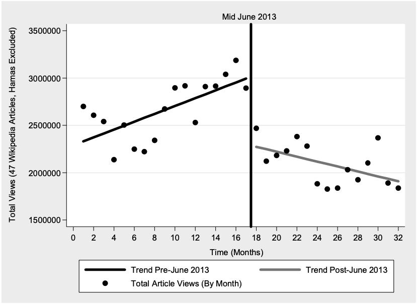
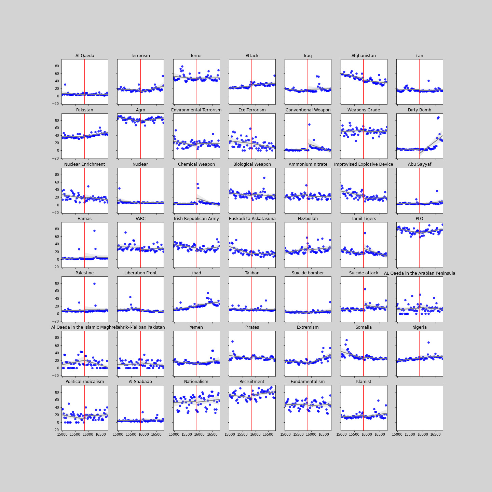

> As the world continues its exponential rate of digitization, governments have 
tried their absolute best to keep up with the rate of change. This entails 
dramatic updates to the most tried and true form of government work, spying on 
citizens.  
> Whereas before these activities were hindered by the very high human capital 
required, digitization has allowed for surveillance to break free of these 
barriers and scale on machines instead of humans. Indeed it is now possible for 
governments not only to spy on specific targets or even their citizens, but 
also spy on citizens of other countries.

-----------------------
## "In a legal context, a chilling effect is the inhibition or discouragement of the legitimate exercise of natural and legal rights by the threat of legal sanction"
Following Edward Snowden's July 2013 leaks of classified US government 
documents, the world finally started to realize the extent of the NSA's 
surveillance network. In his 2016 paper, Jonathon W. Penney showed a 
considerable drop in the 16 months after June 2013 for Wikipedia articles 
that discuss topics related to terrorism. When controlling for other factors 
such as the exogenous shock of war Penney showed a decline not only in overall 
pageviews but also a reversal of the slope in the data trend. 16 months before 
June 2013 the total number of pageviews for the articles were increasingly each 
month, right after June 2013 this trend is reversed and the total number of 
pageviews started to decline. The author attributed this to a chilling effect 
on users who were afraid of being watched by the government.

In this study, we try and verify this claim by examining the same data over a 
longer period of time as well cross-checking if the hypothesis holds with a 
seperate but similar data source that is Google Search Trends. Our initial 
hypothesis was that chilling effects do indeed happen and we will still see 
their effects in the long term data. We therefore divided our project into two 
parts:
<!---
be more 
pronounced in the US and in Arabic countries than in countries being less 
affected by the "war on terror" and therefore presumably the NSA surveillance.
This led us to ask the following 2 research questions
-->
1. Are the observed chilling effects only present on Wikipedia or can they 
also be observed on Google Trends?
2. Are the chilling effects long-lasting, or do they disappear after an 
extended period of time?

<!---
2. What are the different patterns of chilling effects accross different 
languages?
-->

-----------------------
###  1. Are chilling effects also observed on Google Trends?
Although Wikipedia articles are a very popular and widely used source of 
information, it usually constitutes the second layer in an average person's 
information search. People would usually land on the Wikipedia page after 
searching for the term on Google. Therefore, we're going straight to the source 
to try and gather a more representative and complete dataset that would include 
more complex queries that involve the specific topics examined for a similar 
timeframe.  

After applying the same analysis, this is the view we got:

Due to the nature of the Google Trends API, we had to use 
[EPFL dlab's g-tab](https://github.com/epfl-dlab/GoogleTrendsAnchorBank) 
library to get calibrated results for each topic that we could aggregate on 
the same scale. As can be seen, there does not appear to be any noticeable 
chilling effects. We tried to control for exogenous shocks as well but we did 
not observe any significant ones that had significant affects on any single 
topic.

This weakens the initial hypothesis somewhat and raises some new questions on 
the possible reasons of such an unexpected discrepancy between Google Search and 
Wikipedia. These effects are largely based on people's perceived levels of risks 
and not the actual risks posed. For our hypothesis to still stand there needs to
some reason people are assuming that search queries involving these terms do 
not present the same perceived risk. One possible explanation could be that 
users perceive Google searches, involving mostly results from more mainstream
sources and media outlets, with less worry  opposed to Wikipedia which might be 
perceived as a less legitimate and a shadier source of information, especially 
given the widespread campaign in the past of western schools to dissuade 
students from using Wikipedia as a valid source of information in their 
schoolwork.  
Another possible explanation would be the introduction of "in-depth articles" 
by Google as well as Google Hummingbird to their search algorithm, both updates 
that improve Google's knowledge graph feature considerably. Google Knowledge 
graphs show people information, usually from a topic's Wikipedia article, right 
in the search page and therefore might cause a lot of users to not need to visit 
the full Wikipedia page. This has already been widely believed to have caused a 
[considerable decrease in Wikipedia pageviews](https://www.theregister.com/2014/01/13/google_stabs_wikipedia_in_the_front)
following that period.

### 2. Are the chilling effects long term?
One of the conclusions of Penny's paper was that there needed to be longer term 
studies in order to establish a clear chilling effect consequence. A considerable 
amount of time has passed since his paper was published and Wikipedia has kept 
publishing their pageview data. In order to also offer more comprehensive overall 
picture, we not only took the remaining data since the paper was published 
until the present, but also take 2011 data which was not included in the paper 
for an even more robust historical view of its evolution. 

It is important to point out that our data is not perfect and does present some 
anomalies. Mainly that prior to week 75, Wikipedia data was not officially 
released by the site and therefore is not complete. In fact a lot of days 
articles would show 0 pageviews, which even with chilling effects would not be 
realistic. We've tried to map out the missing entries in order to better 
understand how this might affect our analysis. 

We can see a considerable spike in missing data during the period between month 
55 and 60. We've decided to discard in our regression analysis to not skew the 
analysis. The missing data before this period should not be a problem for our 
analysis as we're looking for changes in trends and not absolute data. The 
proportion of missing articles seems consistent throughout the months and so 
shouldn't change any trends.

The results we found were surprising, not only were we not seeing any long term 
chilling effects but the rebound to pre-June 2013 levels happens very quickly 
and suddenly after the last data point of the paper. Our best guess is that this 
is similar to the "privacy paradox" phenomenon.  
People, when bombarded with news and reminders about government surveillance are 
constantly nudged towards thinking about their privacy and how it is being 
infringed upon. However, as soon as the story is dropped from the news cycle, 
people's nonchalance about their privacy and being monitored resurfaces and 
we observe the same trend as pre-June 2013.

## What does this tell us

Not only does the Google Trends data not support our hypothesis, but so does 
the long term Wikipedia data. In the best case scenario, the chilling effects 
only happen short term but eventually diminish after some time. Another possible 
theory would be that these pageview drops are because of the introduction of 
new features to Google's search function that circumvents people's need to visit 
Wikipedia pages. This caused a significant drop at the launch of the feature and 
then the pageviews started to increase again along with general internet usage. 
This would explain why a similar pattern is seen for the comparator group as well.

So in conclusion, the two possible scenarios are either that people do not care 
enough about their privacy, or Google has a really remarkable grip on how people 
use the web and visit website, even for other huge Websites such as Wikipedia. 
We can't really decide which one is more concerning.
