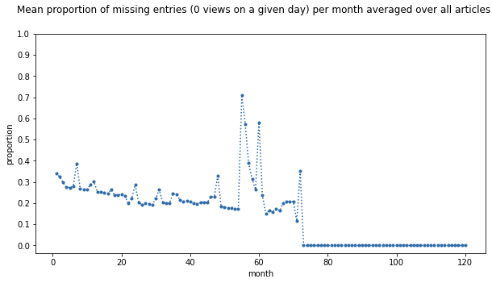
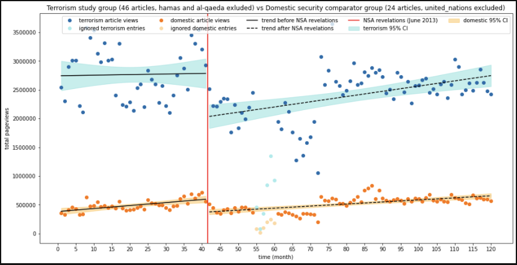
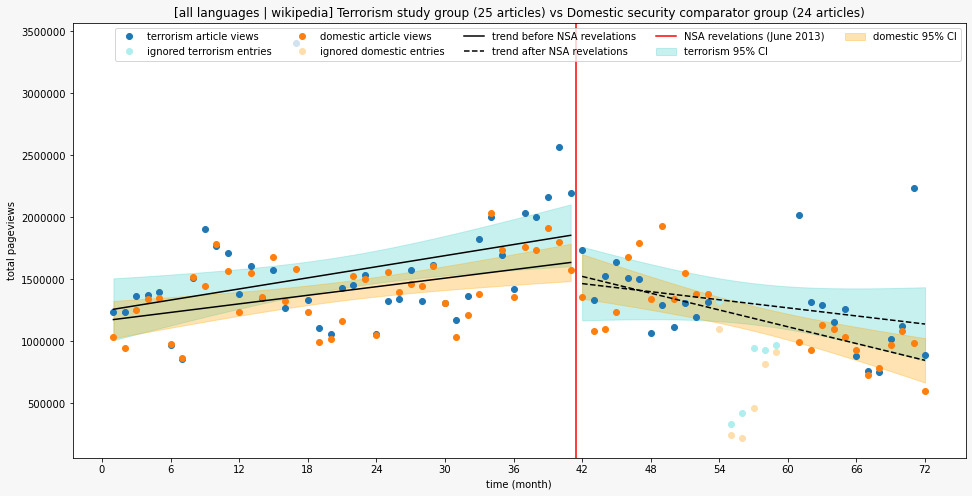
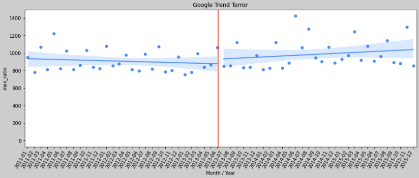

> As the world continues its exponential rate of digitization, governments have tried their absolute best to keep up with the rate of change.
This entails dramatic updates to the most tried and true form of government work, spying on citizens.  
> Whereas before these activities were hindered by the very high human capital required, digitization has allowed for surveillance to break free of these barriers and scale on machines instead of humans.
As a matter of fact, it is now possible for governments not only to spy on specific targets or even their citizens, but also spy on citizens of other countries.

-----------------------
## "In a legal context, a chilling effect is the inhibition or discouragement of the legitimate exercise of natural and legal rights by the threat of legal sanction"
Following Edward Snowden's June 2013 leaks of classified U.S. government documents, the world finally started to realize the extent of the NSA's surveillance network.
In his 2016 paper, Jonathon W. Penney showed a considerable drop in the number of pageviews for Wikipedia articles that discuss topics related to terrorism after the NSA revelations.
When controlling for other factors such as the "exogenous shock of war" (the effect of mediatized conflicts on the number of Wikipedia pageviews for the relevant topic), Penney showed not only an immediate decline in pageviews, but also a change in the trend of Wikipedia accesses over time.
16 months before June 2013, the total number of pageviews for "terrorism" articles was increasing each month, and then right after June 2013 this trend is reversed and the total number of pageviews starts to decline.
The author attributed this to a chilling effect on users who would avoid accessing these topics due to being afraid of being watched by the government.

The topics were picked by the author through a rigorous analysis of a large sample of people's perceived impressions about them, as well as a list from the Department of Homeland security classifying these as 'related to the issue of terrorism'. The author also used a comparator group of topics that are security related but not directly related to terrorism.
In our own study, we try to verify this claim by extending the duration of the analysis, by considering Wikipedia articles in other languages than English, as well  as considering a different but similar data source that is Google Search Trends.  

Our initial hypothesis is that chilling effects do indeed happen and we will still see their effects in the long term data.
We therefore divided our project into three parts:

1. Are the chilling effects long-lasting, or do they disappear after an extended period of time?
2. Are these chilling effects language-dependent (on Wikipedia)? What different reactions to the NSA revelations are there?
3. Are the observed chilling effects only present on Wikipedia or can they also be seen on Google Trends?

-----------------------
### 1. Are the chilling effects long term?
One of the conclusions of Penny's paper was the need of longer term studies in order to confirm that the chilling effects don't go away.
A considerable amount of time has passed since his paper was published and a lot more data has been gathered.
In order to offer a more comprehensive overall picture, we not only used fresh data from after the paper was published until the present, but also older data from 2010 for an even more robust historical view of its evolution. 

It is important to point out that our data is not perfect and does present some anomalies.
Most notably, the API that we used combined data from two different data sources, the official Wikimedia API (starting in 2016) and another website for legacy data.
In fact, a lot of articles show 0 pageviews for some days before 2016, which even with chilling effects would not be realistic.

We can see a considerable spike in the amount of missing data during the period between month 55 and 60.
We've decided to not consider these months in our regression analysis in order not to bias the results.
As such, we will consider the analysis when limiting our data to the end of 2015, and when allowing it to go until 2019.

<!---
<html><head>
    

</head><body>

    <select class="dropdown-wrapper-child" id="ProjectsDropdown">
        <option value="assets/html/sample_plot.html">Sample1</option>
        <option value="assets/html/sample_plot.html">Sample1</option>
        <option value="assets/html/sample_plot.html">Sample1</option>
        <option value="assets/html/sample_plot.html">Sample1</option>
        <option value="assets/html/sample_plot.html">Sample1</option>
        <option value="assets/html/sample_plot.html">Sample1</option>
    </select>

 <object id="plot" style="height: 450pt;width: 100%;" type="text/html" data="assets/html/sample_plot.html" ></object>

</body></html>
-->

The results we found were surprising, not only did we not see any long term chilling effects, but the rebound to pre-June 2013 levels happens very quickly and suddenly after the last data point of the paper.
Our best guess is that this is similar to the "privacy paradox" phenomenon.  
People, when bombarded with news and reminders about government surveillance are constantly nudged towards thinking about their privacy and how it is being infringed upon.
However, as the story is dropped from the news cycle, people's nonchalance about their privacy and being monitored resurfaces and we observe same trend as pre-June 2013 emerge.
<!-- very nice explanation! -->

### 2. Are these chilling effects language-dependent?
Although the NSA is a US Government agency, the US' influence as a world superpower means that everything happening in the US also affects the rest of the world. Especially considering that the people with the highest probability to be monitored or perceive to be monitored are immigrants and expats which might not necessarily use English Wikipedia. Not to mention that the leaks themselves directly mention that the espionage was not only reserved for American citizens or even residents but also foreign residents as well.  

We explored the pageview data for the same articles in 6 different languages of Wikipedia in order to test this and possibly support our hypothesis.

<!---
<html><head>
    

</head><body>

    <select class="dropdown-wrapper-child" id="ProjectsDropdown">
        <option value="assets/html/sample_plot.html">Sample1</option>
        <option value="assets/html/sample_plot.html">Sample1</option>
        <option value="assets/html/sample_plot.html">Sample1</option>
        <option value="assets/html/sample_plot.html">Sample1</option>
        <option value="assets/html/sample_plot.html">Sample1</option>
        <option value="assets/html/sample_plot.html">Sample1</option>
    </select>

 <object id="plot" style="height: 450pt;width: 100%;" type="text/html" data="assets/html/sample_plot.html" ></object>

</body></html>
-->

To our continued surprise, we could not notice any significant chilling effects or downward trend that was drastically different to the comparator group. Some languages even showing the comparator group articles having a larger decrease in pageviews following June 2013.   

Even though there are some obvious outliers in each language, no one thing could explain the lack of chilling effects symptoms as seen in the paper. The plot showing all language views aggregated also paints a similar picture and again makes us reconsider our initial hypothesis.

###  3. Are chilling effects also observed on Google Trends?
Although Wikipedia articles are a very popular and widely used source of information, they usually reside at the second layer in an average person's information search.
Indeed, one would usually land on a Wikipedia page after having searched for the term on Google.
Therefore, we're going straight to the source to try and gather a more representative and complete dataset that would include more complex queries that involve the specific topics examined for a similar timeframe.  

After applying the same analysis, this is the view we got:

<!---
 <object id="plot" style="height: 450pt;width: 100%;" type="text/html" data="assets/html/sample_plot.html" ></object>
-->

Due to the nature of the Google Trends API, we had to use [EPFL dlab's g-tab](https://github.com/epfl-dlab/GoogleTrendsAnchorBank) library to get calibrated results for each topic that we could aggregate on the same scale.
As can be seen in the plot, there does not appear to be any noticeable chilling effects.
We tried to control for exogenous shocks as well but we did not observe any significant ones that had significant affects on any single topic.

This really puts into question the initial hypothesis and raises some new ideas about the possible causes of such an unexpected discrepancy between Google Search and Wikipedia.
Chilling effects are largely based on people's perceived levels of risks and not the actual risks posed.
For our hypothesis to still stand there needs to exist some reason people are assuming that search queries involving these terms do not present the same perceived risk. 
One possible explanation could be that users perceive Google searches, involving mostly results from more mainstream sources and media outlets, with less worry  opposed to Wikipedia which might be perceived as a less legitimate and a shadier source of information, especially given the widespread campaign in the past of western schools to dissuade students from using Wikipedia as a valid source of information in their schoolwork.  
Another possible explanation would be the introduction of "in-depth articles" by Google as well as Google Hummingbird to their search algorithm, both updates that improve Google's knowledge graph feature considerably.
Google Knowledge graphs show people information, usually from a topic's Wikipedia article, right in the search page and therefore might cause a lot of users to not need to visit the full Wikipedia page.
This has already been widely believed to have caused a [considerable decrease in Wikipedia pageviews](https://www.theregister.com/2014/01/13/google_stabs_wikipedia_in_the_front) after the features were introduced.

## What does this tell us
Neither the Google Trends data nor the extended Wikipedia data support our (and the author's) hypothesis.
In the best case scenario, the chilling effects only happen short term but eventually diminish after some time.
Another possible theory would be that these pageview drops are because of the introduction of new features to Google's search function that circumvents people's need to visit Wikipedia pages.
This caused a significant drop at the launch of the feature and then the pageviews started to increase again along with general internet usage. 
This would explain why a similar phenomenon is seen for the comparator group losing a significant amount of pageviews in the same period as well.

So in conclusion, the two possible scenarios are either that people do not care enough about their privacy, or Google has a really remarkable grip on how people use the web and visit websites, even for other huge Websites such as Wikipedia.   

Honestly, we can't really decide which scenario is scarier.
