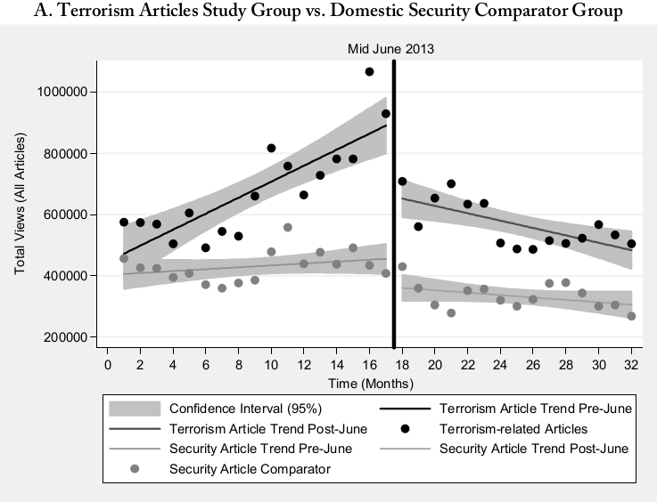

> As the global digitalization advanced at a steadily increasing speed, governments have tried their absolute best to keep up with the rate of change.
This has entailed dramatic updates to one of the most tried forms of government work: surveillance and espionage.  

> While these activities were previously limited by the very high human capital required, digitization has allowed for surveillance to break free of these barriers and scale on machines instead of humans.
As a matter of fact, it is easier than ever for governments to not only to spy on specific targets or their own citizens, but also on individuals living in entirely other regions of the world.

-----------------------
## "In a legal context, a chilling effect is the inhibition or discouragement of the legitimate exercise of natural and legal rights by the threat of legal sanction"
Following Edward Snowden's June 2013 leaks of classified U.S. government documents, the world started to realize the extent of the NSA's surveillance network.
The public outrage was massive in the beginning, but as time passed the topic began to vanish from the front pages of newspapers.
Most importantly, the NSA leaks did not seem to have negative repercussions on the extent of online surveillance.

Online privacy is a controversial topic, and one might ask oneself why the surveillance conducted by the NSA is such a bad thing, after all.
Some argue that online surveillance is beneficial for security and terrorism prevention.
Civil right activists and privacy advocates would strongly disagree, and one of their main arguments was phrased by Edward Snowden in the following words: "Under observation, we act less free, which means we effectively are less free".

The theory whereby citizens act "less free" due to their knowledge about surveillance is called **chilling effect**.
In the 2016 paper "Chilling Effects: Online Surveillance and Wikipedia Use", Jonathon W. Penney tried to prove the existence of chilling effects by analyzing Wikipedia pageviews before and after the June 2013 NSA scandal.
Indeed, he showed a considerable drop in the number of pageviews for Wikipedia articles that discuss topics related to terrorism immediately after the NSA revelations.
These topics were chosen based on a survey that asked whether people would feel uncomfortable if they were certain that the government knew they are reading about them online.
When controlling for other factors such as "exogenous shocks of war" (the effect of mediatized conflicts on the number of Wikipedia pageviews for the relevant topic), Penney showed not only an immediate decline in pageviews, but also a change in the trend of Wikipedia accesses over time.
During the 16 months preceding June 2013, the total number of monthly pageviews for "terrorism" articles was on the rise, and then right after June 2013 this trend is reversed and the monthly number of pageviews starts to decline.
The author attributed these results to a chilling effect on users and further supported this thesis by showing that, for a comparator group containing articles about similar but less privacy-sensitive topics (related to U.S. domestic security), no such effect could be observed.

The topics were picked by combining an analysis on a sample of volunteer's perception of the topics, as well as a curated list from the Department of Homeland security classifying these topics as 'related to the issue of terrorism'.
The comparator group of topics were security related but not directly related to terrorism.
Penney's analysis seemed to prove the existence of chilling effects by clearly showing a difference between the pre- and post-Snowden eras.

Nevertheless, we wanted to dig further into the topic and take a closer look: can we observe similar chilling effects when considering a longer time range? Do other data sources support this theory of chilling effects even more? Or could it be just an unlucky correlation that Penney found?

To answer these questions, we divided our project into three targeted questions, that we will answer individually:
1. Are the chilling effects on Wikipedia long-lasting, or do they disappear after some period of time?
2. Are these chilling effects on Wikipedia language-dependent? What different reactions to the NSA revelations are there?
3. Are the observed chilling effects only present on Wikipedia or can they also be seen on Google Trends?

-----------------------
### 1. Are the chilling effects long lasting?
One of the conclusions of Penny's paper was the need of longer term studies in order to confirm that the chilling effects aren't short-lived.
Luckily, a considerable amount of time has passed since his paper was published and a lot more data has been gathered since.
In order to offer a more comprehensive overall picture, we not only used fresh data from after the paper was published until the present, but also older data from 2010 for an even more robust historical view of its evolution. 

<!-- NOT SURE IF THIS PART IS RELEVANT -->

<!-- However, it is important to point out that our data is not perfect and does present some anomalies.
Most notably, the API that we used combined data from two different data sources, the official Wikimedia API (starting in 2016) and another website for legacy data.
In fact, a lot of articles show 0 pageviews for some days before 2016, which even with chilling effects would not be realistic. -->

<!--  -->

<!--We can see a considerable spike in the amount of missing data during the period between month 55 and 60.
Accordingly, we decided to disregard these months in our regression analysis to avoid biasing the results.
Our analysis will also be two fold, one until the end of 2015 and another untill 2019, this is to take into account the change in API and the possibility of inconsistent data. -->

<html>
    <head>
        
    </head>
    <body>
        

            <select class="dropdown-wrapper-child" id="ProjectsDropdown">
                <option value="assets/interactive_plots/wiki_all.html">Data until 2015</option>
                <option value="assets/interactive_plots/wiki_all_long.html">Data until 2019</option>
            </select>
        

        <object id="plot" style="height: 450pt;width: 100%;" type="text/html" data="assets/interactive_plots/wiki_all.html" ></object>
        
    </body>
</html>
<!---  -->

The results for both analyses were surprising, not only did we not see any long term chilling effects, but pageviews trend rebounds to a pre-June 2013 slope very quickly and suddenly after the last data point of the paper.
When stopping at 2015, we still see a gradually less pronounced decrease in pageviews as time goes on. Extending the data till 2019 shows an almost identical slope to pre-June 2013 levels. Although the missing data might mean the absolute number of pageviews pre-2013 was still higher, the slope is consistent and seems to have completely recovered, indicating a largely diminished chilling effect and a return to normal behavior.
Our best guess as to why that is relates to the "privacy paradox" phenomenon.  
People, when bombarded with news and reminders about government surveillance, are constantly nudged towards thinking about their privacy and how it is being infringed upon.
However, as the story is dropped from the news cycle, people's nonchalance about their privacy and being monitored resurfaces and we observe same trend as pre-June 2013 emerge.

### 2. Are these chilling effects language-dependent?
Although the NSA is a U.S. Government agency, the U.S.' influence as a world "superpower" means that many things happening in the US also affect the rest of the world.
It is also worth considering that the U.S. residents with the highest probability of being monitored are immigrants and expats who might not necessarily use English Wikipedia.
In addition, the leaks themselves directly mention that the espionage was not targeted specifically at U.S. citizens or even U.S. residents, but mainly at foreign residents.

As such, we analysed the pageviews for the same two groups of Wikipedia articles, but translated into 5 additional languages: French, German, Italian, Portuguese and Spanish.
You can interactively select a language below and see what the resulting trends are before and after the NSA revelations:
<html>
    <head>
        
    </head>
    <body>
        

            <select class="dropdown-wrapper-child" id="ProjectsDropdown">
                <option value="assets/interactive_plots/wiki_all.html">All 6 languages</option>
                <option value="assets/interactive_plots/wiki_en.html">English</option>
                <option value="assets/interactive_plots/wiki_fr.html">French</option>
                <option value="assets/interactive_plots/wiki_de.html">German</option>
                <option value="assets/interactive_plots/wiki_it.html">Italian</option>
                <option value="assets/interactive_plots/wiki_pt.html">Portuguese</option>
                <option value="assets/interactive_plots/wiki_es.html">Spanish</option>
            </select>
        

        <object id="plot" style="height: 450pt;width: 100%;" type="text/html" data="assets/interactive_plots/wiki_all.html" ></object>
        
    </body>
</html>

<!-- REDO THIS PART ONCE RESULTS ARE UPDATED -->

To our continued surprise, we could not notice any significant chilling effects or downward trend that was drastically different to the comparator group. Some languages even showing the comparator group articles with a larger decrease in pageviews following June 2013 compared to the terrorism topics.   

Even though there are some obvious outliers in each language, we do not believe these could explain the lack of chilling effects symptoms as seen in the paper, some even have a higher average monthly pageview than before. The plot showing all language views aggregated should allow for the outliers to cancel each other out as they happen on different months. But, as can be seen, it also paints a similar picture and again makes us reconsider our initial hypothesis.

###  3. Are chilling effects also observed on Google Trends?
Although Wikipedia articles are a very popular and widely used source of information, they usually reside at the second layer in an average person's information search.
Indeed, one would usually land on a Wikipedia page after having searched for the corresponding or related term on Google.
Therefore, we're going straight to the source to try and gather a more representative and complete dataset that would include more complex queries that involve the specific topics, and we perform our analysis on the same time range as the author.

After applying the same analysis, this is the view we got:

<html>
    <head>
        
    </head>
    <body>
        

            <select class="dropdown-wrapper-child" id="ProjectsDropdown">
                <option value="assets/interactive_plots/google_trends_short.html">Data until 2015</option>
                <option value="assets/interactive_plots/google_trends_long.html">Data until 2019</option>
            </select>
        

        <object id="plot" style="height: 450pt;width: 100%;" type="text/html" data="assets/interactive_plots/google_trends_short.html" ></object>
        
    </body>
</html>
<!---  -->

<!---
 <object id="plot" style="height: 450pt;width: 100%;" type="text/html" data="assets/html/sample_plot.html" ></object>
-->

<!-- POTENTIALLY REDO THIS AFTER NEW RESULTS -->

Due to the nature of the Google Trends API, we had to use [EPFL dlab's g-tab](https://github.com/epfl-dlab/GoogleTrendsAnchorBank) library to get calibrated results for each topic that we could compare on the same scale.
As we can see in the plot, there does not appear to be any noticeable chilling effects.
We tried to control for exogenous shocks as well but we did not observe any significant ones that had noticeable effects on any single topic.

This really goes against the author's claim and raises some new ideas about the possible causes of such an unexpected discrepancy between Google Search and Wikipedia.
Chilling effects are largely based on people's perceived levels of risk, and not on the actual risks that they might face.
For the author's claim to still stand, there needs to exist some reason why people are assuming that search queries involving these terms do not present the same level of risk as accessing a Wikipedia article.
<!-- I'm not sure I like this part, it's not really relevant and Wikipedia is a reliable source, teachers just don't want people to copy things without checking them -->

Another possible explanation would be the introduction of the Google features "in-depth articles" and Google Hummingbird, which improve the search engine's knowledge graph considerably.
Google knowledge graphs show information about people and events, usually from a topic's Wikipedia article, right in the search page and therefore might cause a lot of users to not need to visit the full Wikipedia page.
This has already been widely believed to have caused a [considerable decrease in Wikipedia pageviews](https://www.theregister.com/2014/01/13/google_stabs_wikipedia_in_the_front) after the features were introduced.

## What does this tell us
Neither the Google Trends data nor the extended Wikipedia data support our (and the author's) hypothesis.
In the best case scenario, the chilling effects only happen short term but eventually diminish after some time.
Another possible theory would be that these pageview drops are because of the introduction of new features to Google's search function that circumvents people's need to visit Wikipedia pages.
This caused a significant drop at the launch of the feature and then the pageviews started to increase again along with general internet usage. 
This would explain why a similar phenomenon is seen for the comparator group losing a significant amount of pageviews in the same period as well.

So in conclusion, the two possible scenarios are either that people do not care enough about their privacy, or Google has a really remarkable grip on how people use the web and visit websites, even for other huge Websites such as Wikipedia.   

Honestly, we can't really decide which scenario is scarier.
